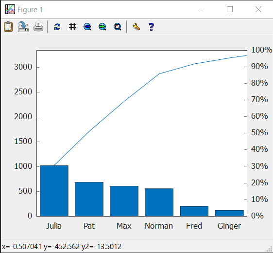

<!---
marp: true
author: Yi-Wen Hung
theme: default
headingDivider: 2
paginate: true
--->

# (Extra) C++ Image Export & Matplot++

> Slides version: [lecture16_slides.html](./lecture16_slides.html)
> Website version: [lecture16.html](./lecture16.html)

- Tutorial: Matplot++
  - Installation
  - Hello world
  - Plot Functions
  - Annotations
  - Appearance
  - Export to image
- Example: Plot a Geometry on Complex Plane
- Pratices

## Installation

### Windows + MinGW: Update `gcc`

**Note**: 須先完成 [設定 VSCode 環境 (Windows + MinGW)](../vscode_tutorial/lab_1_vscode_win.html#設定-vscode-環境-windows--mingw) 再進行下一步

Terminal:

```sh
# remove old gcc 8.1.0
scoop uninstall mingw
# install new gcc 12.1.0
scoop install mingw-winlibs
```

---
### Linux/macOS: Install CMake

Terminal:

#### Linux

``` bash
sudo apt install cmake
```

#### macOS

``` bash
brew install cmake
```

---
### Install [`gnuplot`](http://www.gnuplot.info/download.html)

Terminal:

#### Windows

``` powershell
scoop install gnuplot
```

#### Linux

``` bash
sudo apt install gnuplot
```

#### macOS

``` bash
brew install gnuplot
```

**Note**: 安裝完成後須重新啟動 VSCode 及重新打開 Terminal 才能生效

---
### Update VSCode C/C++ Extension

Install [C/C++ Extension Pack](https://marketplace.visualstudio.com/items?itemName=ms-vscode.cpptools-extension-pack)

Correct:


---
### Install [Matplot++](https://github.com/alandefreitas/matplotplusplus)

#### Download project file & open in VSCode:

1. github link [stevenokm/matplotplusplus-master.zip](https://github.com/stevenokm/matplotplusplus/archive/refs/heads/master.zip)
2. 解壓縮全部，解壓縮後會有一個 `matplotplusplus-master` 目錄
3. 使用 VSCode 打開 `matplotplusplus-master` 目錄

---
#### Build Matplot++ & Test Matplot++
 
1. configure project "matplotplusplus-master" (Yes)


---
2. select right active kit
   1. Windows: `GCC 12.1.0 x86_64-w64-mingw32`
   2. Linux: `GCC 9.4.0 x86_64-linux-gnu` (Ubuntu 20.04)
   3. macOS: `Clang 13.0.0 arm64-apple-darwin20.6.0` (macOS Big Sur, Apple Silicon)


---
3. Press "Build" button on the bottom of the VSCode window


---
4. Press "Run" button on the bottom of the VSCode window


---
5. Press "Debug" button on the bottom of the VSCode window to debug

**Note** 要注意 CMake 的設定是在 Debug `CMake: [Debug]` 下執行的


## Hello world

Ref: [Bar Plot - Matplot++](https://alandefreitas.github.io/matplotplusplus/plot-types/discrete-data/bar-plot/)

```cpp
#include <cmath>
#include <matplot/matplot.h>

int main()
{
    using namespace matplot;

    std::vector<double> y = {75, 91, 105, 123.5, 131, 150,
                             179, 203, 226, 249, 281.5};
    bar(y);

    show();
    return 0;
}
```

---
Result:


## Plot Functions

- Line Plot
- Histogram
- Scatter Plot
- Bar Plot
- Pareto Chat
- Polar Line Plot

---
### Line Plot

Ref: [Line Plot - Matplot++](https://alandefreitas.github.io/matplotplusplus/plot-types/line-plots/line-plot/)

```cpp
#include <cmath>
#include <matplot/matplot.h>

int main()
{
    using namespace matplot;

    std::vector<int> y = {2, 4, 7, 7, 6, 3, 9, 7, 3, 5};
    plot(y);

    show();
    return 0;
}
```

---
Result:


---
### Histogram

Ref: [Histogram - Matplot++](https://alandefreitas.github.io/matplotplusplus/plot-types/data-distribution/histogram/)

```cpp
#include <cmath>
#include <matplot/matplot.h>
#include <random>

int main()
{
    using namespace matplot;

    std::vector<double> x = randn(10000, 0, 1);

    auto h = hist(x);
    std::cout << "Histogram with " << h->num_bins() << " bins" << std::endl;

    show();
    return 0;
}
```

---
Result:


---
### Scatter Plot

Ref: [Scatter Plot - Matplot++](https://alandefreitas.github.io/matplotplusplus/plot-types/data-distribution/scatter-plot/)

```cpp
#include <matplot/matplot.h>
#include <random>

int main()
{
    using namespace matplot;

    auto x = linspace(0, 3 * pi, 200);
    auto y = transform(x, [&](double x)
                       { return cos(x) + rand(0, 1); });

    scatter(x, y);

    show();
    return 0;
}
```

---
Result:


---
### Bar Plot

Ref: [Bar Plot - Matplot++](https://alandefreitas.github.io/matplotplusplus/plot-types/discrete-data/bar-plot/)

```cpp
#include <cmath>
#include <matplot/matplot.h>
#include <random>

int main()
{
    using namespace matplot;

    std::vector<std::vector<double>> Y = {
        {2, 2, 2, 2}, {2, 5, 8, 11}, {3, 6, 9, 12}};
    bar(Y);

    show();
    return 0;
}
```

---
Result:


---
### Pareto Chat

Ref: [Pareto Chat - Matplot++](https://alandefreitas.github.io/matplotplusplus/plot-types/discrete-data/pareto-chat/)

```cpp
#include <cmath>
#include <matplot/matplot.h>
#include <random>

int main()
{
    using namespace matplot;

    std::vector<double> codelines = {200, 120, 555, 608, 1024, 101, 57, 687};
    std::vector<std::string> coders = {"Fred", "Ginger", "Norman", "Max",
                                       "Julia", "Wally", "Heidi", "Pat"};

    pareto(codelines, coders);
    title("Lines of Code by Programmer");

    show();
    return 0;
}
```

---
Result:



---
### Polar Line Plot

Ref: [Polar Line Plot - Matplot++](https://alandefreitas.github.io/matplotplusplus/plot-types/polar-plots/polar-line-plot/)

```cpp
#include <cmath>
#include <matplot/matplot.h>

int main()
{
    using namespace matplot;

    std::vector<double> theta_degrees = linspace(0, 360, 50);
    std::vector<double> rho =
        transform(theta_degrees, [](auto t)
                  { return 0.005 * t / 10.; });
    std::vector<double> theta_radians = deg2rad(theta_degrees);
    polarplot(theta_radians, rho);

    show();
    return 0;
}
```

---
Result:


## Annotations

- Text
- Text with Arrow
- Rectangle
- Textbox

---
### Text

Ref: [Text - Matplot++](https://alandefreitas.github.io/matplotplusplus/annotations/text/)

```cpp
#include <cmath>
#include <matplot/matplot.h>

int main()
{
    using namespace matplot;

    std::vector<double> x = linspace(-5, +5);
    std::vector<double> y =
        transform(x, [](auto x)
                  { return pow(x, 3) - 12 * x; });
    plot(x, y);

    std::vector<double> xt = {-2, +2};
    std::vector<double> yt = {16, -16};
    std::string str = "dy/dx = 0";
    text(xt, yt, str);

    show();
    return 0;
}
```

---
Result:


---
### Text with Arrow

Ref: [Text with Arrow - Matplot++](https://alandefreitas.github.io/matplotplusplus/annotations/text-with-arrow/)

```cpp
#include <cmath>
#include <matplot/matplot.h>

int main()
{
    using namespace matplot;

    plot(iota(1, 10));
    auto [t, a] = textarrow(2.5, 6.5, 5, 5, "y=x");
    t->color("red").font_size(14);
    a->color("blue");

    show();
    return 0;
}
```

---
Result:


---
### Rectangle

Ref: [Rectangle - Matplot++](https://alandefreitas.github.io/matplotplusplus/annotations/rectangle/)

```cpp
#include <cmath>
#include <matplot/matplot.h>

int main()
{
    using namespace matplot;

    rectangle(2, 4, 2, 2, 1.);
    auto r2 = rectangle(2, 4, 2, 2, 0.);
    r2->color("red");
    axis(equal);

    show();
    return 0;
}
```

---
Result:


---
### Textbox

Ref: [Textbox - Matplot++](https://alandefreitas.github.io/matplotplusplus/annotations/textbox/)

```cpp
#include <cmath>
#include <matplot/matplot.h>

int main()
{
    using namespace matplot;

    plot(iota(1, 10));
    textbox(2, 8, 4, 0.5, "String line from 1 to 10");

    show();
    return 0;
}
```

---
Result:


## Export to image

- Manually
- Programmatically

---
### Manually

1. Click on the `Export to image` button


---
2. Type filename


---
### ProgProgrammatically

Export files with `save()`

```cpp
#include <cmath>
#include <matplot/matplot.h>

int main()
{
    using namespace matplot;

    plot(iota(1, 10));
    textbox(2, 8, 4, 0.5, "String line from 1 to 10");

    // show();

    // windows gnuplot bug workaround
    save("../textbox_export.png");

    // export to file with fileextension .png
    save("../textbox_export.png");
    // or with filename and filetype
    save("../textbox_export", "svg");

    return 0;
}
```

---
Result: `textbox_export.png`


---
Result: `textbox_export.svg`


## Example: Plot a Geometry on Complex Plane [[Source](./lecture16_ex.html)]

## Pratices

- Draw & Save `Triangle_2D` in 2D plane by matplot++
- Draw & Save `Triangle_Comp` in Polar Complex plane by matplot++