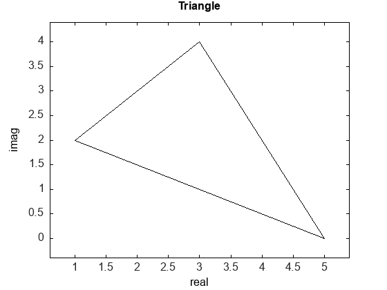
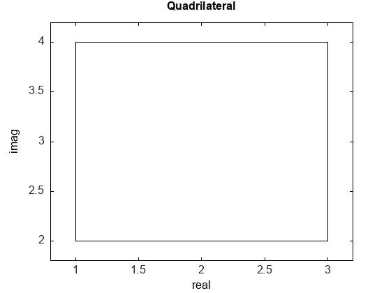
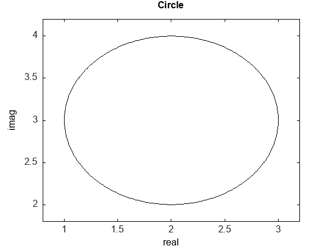
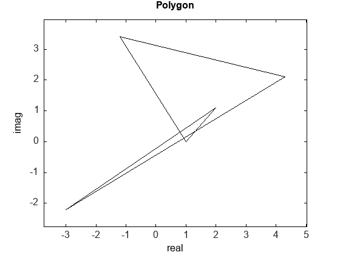

# Example: Plot a Geometry on Complex Plane

``` c++
{{#include example_cpp/lecture16_ex.cpp}}
```

Input:

```console
$ ./main
t⏎
3⏎
1.0 2.0⏎
3.0 4.0⏎
5.0 0.0⏎
t
3
1 + 2i
3 + 4i
5
q⏎
4⏎
1.0 2.0⏎
3.0 2.0⏎
3.0 4.0⏎
1.0 4.0⏎
q
4
1 + 2i
3 + 2i
3 + 4i
1 + 4i
c⏎
2⏎
1.0 2.0⏎
3.0 4.0⏎
c
2
1 + 2i
3 + 4i
p⏎
5⏎
1.0 0.0⏎
2.0 1.1⏎
-3.0 -2.2⏎
4.3 2.1⏎
-1.2 3.4⏎
p
5
1
2 + 1.1i
-3 - 2.2i
4.3 + 2.1i
-1.2 + 3.4i
^Z⏎
```

Result:




