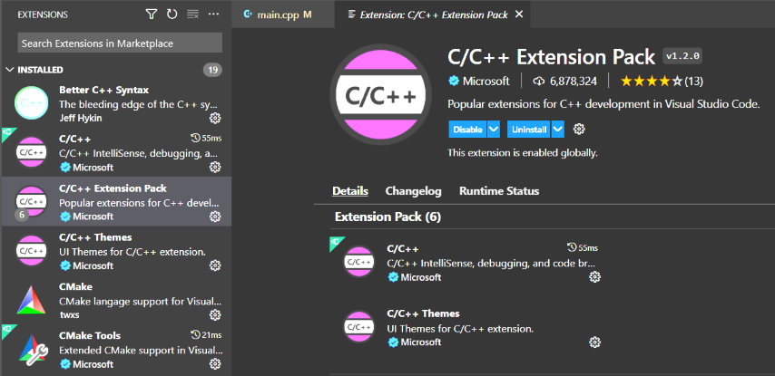
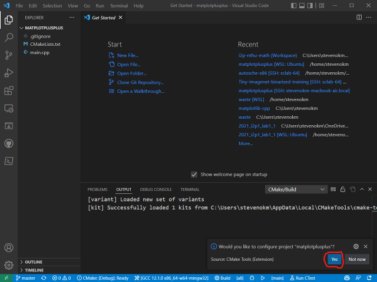

<!---
marp: true
author: Yi-Wen Hung
theme: default
headingDivider: 2
paginate: true
--->

# (Extra) Google Test for Class 

> Slides version: [lecture18_slides.html](./lecture18_slides.html)
> Website version: [lecture18.html](./lecture18.html)

Prerequisite Lecture: [Lecture 16: GoogleTest Tutorial](https://stevenokm.github.io/i2p-nthu-math/i2p1/googletest/lecture16.html)

- Google Test
  - Installation
  - Hello world
- Google Test for Class
  - What is Unit Test?
  - Example: unit test for class (sample4 & sample5)
- Example: Unit Test for Vector & Matrix in Binary File (class ver.)
- Pratices

## Installation

### Windows + MinGW: Update `gcc`

**Note**: 須先完成 [設定 VSCode 環境 (Windows + MinGW)](../vscode_tutorial/lab_1_vscode_win.html#設定-vscode-環境-windows--mingw) 再進行下一步

Terminal:

```sh
# remove old gcc 8.1.0
scoop uninstall mingw
# install new gcc 12.1.0
scoop install mingw-winlibs
```

---
### Linux/macOS: Install CMake

Terminal:

#### Linux

``` bash
sudo apt install cmake
```

#### macOS

``` bash
brew install cmake
```

---
### Update VSCode C/C++ Extension

Install [C/C++ Extension Pack](https://marketplace.visualstudio.com/items?itemName=ms-vscode.cpptools-extension-pack)

Correct:



---
### Hello GoogleTest

Ref: [Quickstart: Building with CMake](https://google.github.io/googletest/quickstart-cmake.html#create-and-run-a-binary)

1. 建立專案資料夾 (e.g. `googletest`)
2. 使用 VSCode 打開專案資料夾
3. 新增 `hello_test.cpp` & `CMakeLists.txt`，內容如下：

`hello_test.cpp`

``` c++
#include <gtest/gtest.h>

// Demonstrate some basic assertions.
TEST(HelloTest, BasicAssertions)
{
    // Expect two strings not to be equal.
    EXPECT_STRNE("hello", "world");
    // Expect equality.
    EXPECT_EQ(7 * 6, 42);
}
```

---

`CMakeLists.txt`

``` cmake
cmake_minimum_required(VERSION 3.14)
project(hello_test)

# GoogleTest requires at least C++11
set(CMAKE_CXX_STANDARD 11)

include(FetchContent)
FetchContent_Declare(
  googletest
  URL https://github.com/google/googletest/archive/609281088cfefc76f9d0ce82e1ff6c30cc3591e5.zip
)
# For Windows: Prevent overriding the parent project's compiler/linker settings
set(gtest_force_shared_crt ON CACHE BOOL "" FORCE)
FetchContent_MakeAvailable(googletest)

enable_testing()

add_executable(
  hello_test
  hello_test.cpp
)
target_link_libraries(
  hello_test
  gtest_main
)

include(GoogleTest)
gtest_discover_tests(hello_test)
```

---
4. 重新使用 VSCode 打開專案資料夾
5. configure project "matplotplusplus-master" (Yes)



---
6. select right active kit
   1. Windows: `GCC 12.1.0 x86_64-w64-mingw32`
   2. Linux: `GCC 9.4.0 x86_64-linux-gnu` (Ubuntu 20.04)
   3. macOS: `Clang 13.0.0 arm64-apple-darwin20.6.0` (macOS Big Sur, Apple Silicon)


---
7. Press "Build" button on the bottom of the VSCode window


---
8. Press "Run" button on the bottom of the VSCode window


---
Terminal:

``` console
Running main() from C:\Users\stevenokm\googletest\build\_deps\googletest-src\googletest\src\gtest_main.cc
[==========] Running 1 test from 1 test suite.
[----------] Global test environment set-up.
[----------] 1 test from HelloTest
[ RUN      ] HelloTest.BasicAssertions
[       OK ] HelloTest.BasicAssertions (0 ms)
[----------] 1 test from HelloTest (2 ms total)

[----------] Global test environment tear-down
[==========] 1 test from 1 test suite ran. (9 ms total)
[  PASSED  ] 1 test.
```

## Google Test for Class

Ref: [Unit Testing | Software Testing](https://www.geeksforgeeks.org/unit-testing-software-testing/)

- What is Unit Test?
- Objective of Unit Testing
- Types of Unit Testing
- Unit Testing Techniques
- Example: unit test for class

---
### What is Unit Test?

> Unit Testing is a software testing technique by means of which individual units of software i.e. group of computer program modules, usage procedures, and operating procedures are tested to determine whether they are suitable for use or not. 


---
### Objective of Unit Testing

1. To isolate a section of code.
2. To verify the correctness of the code.
3. To test every function and procedure.
4. To fix bugs early in the development cycle and to save costs.
5. To help the developers to understand the code base and enable them to make changes quickly.
6. To help with code reuse.

---
### Types of Unit Testing

There are 3 types of Unit Testing Techniques. They are:

- Black Box Testing: This testing technique is used in covering the unit tests for input, user interface, and output parts.
- White Box Testing: This technique is used in testing the functional behavior of the system by giving the input and checking the functionality output including the internal design structure and code of the modules.
- Gray Box Testing: This technique is used in executing the relevant test cases, test methods, test functions, and analyzing the code performance for the modules.


---
#### Black Box Testing

Ref: [Black-box testing - Wikipedia](https://en.wikipedia.org/wiki/Black-box_testing)

> Black-box testing is a method of software testing that examines the functionality of an application without peering into its internal structures or workings.
> This method of test can be applied virtually to every level of software testing: unit, integration, system and acceptance.
> It is sometimes referred to as specification-based testing.

System diagram:


---
#### White Box Testing

Ref: [White-box testing - Wikipedia](https://en.wikipedia.org/wiki/White-box_testing), [File:WhiteBoxTesting.png](https://commons.wikimedia.org/wiki/File:WhiteBoxTesting.png)

> White-box testing is a method of software testing that tests internal structures or workings of an application, as opposed to its functionality (i.e. black-box testing).
> In white-box testing an internal perspective of the system, as well as programming skills, are used to design test cases.


---
#### Gray Box Testing

Ref: [Gray-box testing - Wikipedia](https://en.wikipedia.org/wiki/Gray-box_testing), [Model Identification Using Stochastic Differential Equation Grey-Box Models in Diabetes](https://doi.org/10.1177%2F193229681300700220)

> Gray-box testing is a combination of white-box testing and black-box testing.
> A gray-box tester partially knows the internal structure, which includes access to the documentation of internal data structures as well as the algorithms used.


---
### Example: unit test for class

Ref: [googletest/googletest/samples](https://github.com/google/googletest/tree/main/googletest/samples)

- CMake Setup Update
- Example: `Counter` class
- Example: `MyString` class

---
#### CMake Setup Update

``` cmake
# ...

add_executable(
  hello_test
  hello_test.cpp
)
target_link_libraries(
  hello_test
  gtest_main
)

add_executable(
  sample2_unittest
  sample2_unittest.cc
  sample2.cc
)
target_link_libraries(
  sample2_unittest
  gtest_main
)

add_executable(
  sample4_unittest
  sample4_unittest.cc
  sample4.cc
)
target_link_libraries(
  sample4_unittest
  gtest_main
)

include(GoogleTest)
gtest_discover_tests(hello_test)
gtest_discover_tests(sample2_unittest)
gtest_discover_tests(sample4_unittest)
```

---
#### Example: `Counter` class

[`sample4.h`](example_cpp/sample4.h)

``` c++
// A sample program demonstrating using Google C++ testing framework.
#ifndef GTEST_SAMPLES_SAMPLE4_H_
#define GTEST_SAMPLES_SAMPLE4_H_

// A simple monotonic counter.
class Counter
{
private:
  int counter_;

public:
  // Creates a counter that starts at 0.
  Counter() : counter_(0) {}

  // Returns the current counter value, and increments it.
  int Increment();

  // Returns the current counter value, and decrements it.
  int Decrement();

  // Prints the current counter value to STDOUT.
  void Print() const;
};

#endif // GTEST_SAMPLES_SAMPLE4_H_
```

---

[`sample4.cc`](example_cpp/sample4.cc)

``` c++
// A sample program demonstrating using Google C++ testing framework.

#include <iostream>

#include "sample4.h"

// Returns the current counter value, and increments it.
int Counter::Increment()
{
  return counter_++;
}

// Returns the current counter value, and decrements it.
// counter can not be less than 0, return 0 in this case
int Counter::Decrement()
{
  if (counter_ == 0)
  {
    return counter_;
  }
  else
  {
    return counter_--;
  }
}

// Prints the current counter value to STDOUT.
void Counter::Print() const
{
  std::cout << counter_;
}
```

---

[`sample4_unittest.cc`](example_cpp/sample4_unittest.cc)

``` c++
#include "sample4.h"
#include "gtest/gtest.h"

namespace
{
  // Tests the Increment() method.

  TEST(Counter, Increment)
  {
    Counter c;

    // Test that counter 0 returns 0
    EXPECT_EQ(0, c.Decrement());

    // EXPECT_EQ() evaluates its arguments exactly once, so they
    // can have side effects.

    EXPECT_EQ(0, c.Increment());
    EXPECT_EQ(1, c.Increment());
    EXPECT_EQ(2, c.Increment());

    EXPECT_EQ(3, c.Decrement());
  }

} // namespace
```

---

Result:

``` console
Running main() from C:\Users\stevenokm\googletest\build\_deps\googletest-src\googletest\src\gtest_main.cc
[==========] Running 1 test from 1 test suite.
[----------] Global test environment set-up.
[----------] 1 test from Counter
[ RUN      ] Counter.Increment
[       OK ] Counter.Increment (0 ms)
[----------] 1 test from Counter (2 ms total)

[----------] Global test environment tear-down
[==========] 1 test from 1 test suite ran. (10 ms total)
[  PASSED  ] 1 test.
```

---
#### Example: `MyString` class

[`sample2.h`](example_cpp/sample2.h)

``` c++
// A sample program demonstrating using Google C++ testing framework.

#ifndef GTEST_SAMPLES_SAMPLE2_H_
#define GTEST_SAMPLES_SAMPLE2_H_

#include <string.h>

// A simple string class.
class MyString
{
private:
  const char *c_string_;
  const MyString &operator=(const MyString &rhs);

public:
  // Clones a 0-terminated C string, allocating memory using new.
  static const char *CloneCString(const char *a_c_string);

  ////////////////////////////////////////////////////////////
  //
  // C'tors

  // The default c'tor constructs a NULL string.
  MyString() : c_string_(nullptr) {}

  // Constructs a MyString by cloning a 0-terminated C string.
  explicit MyString(const char *a_c_string) : c_string_(nullptr)
  {
    Set(a_c_string);
  }

  // Copy c'tor
  MyString(const MyString &string) : c_string_(nullptr)
  {
    Set(string.c_string_);
  }
```
---
``` c++
  ////////////////////////////////////////////////////////////
  //
  // D'tor.  MyString is intended to be a final class, so the d'tor
  // doesn't need to be virtual.
  ~MyString() { delete[] c_string_; }

  // Gets the 0-terminated C string this MyString object represents.
  const char *c_string() const { return c_string_; }

  size_t Length() const { return c_string_ == nullptr ? 0 : strlen(c_string_); }

  // Sets the 0-terminated C string this MyString object represents.
  void Set(const char *c_string);
};

#endif // GTEST_SAMPLES_SAMPLE2_H_
```

---

[`sample2.cc`](example_cpp/sample2.cc)

``` c++
// A sample program demonstrating using Google C++ testing framework.

#include "sample2.h"

#include <string.h>

// Clones a 0-terminated C string, allocating memory using new.
const char *MyString::CloneCString(const char *a_c_string)
{
  if (a_c_string == nullptr)
    return nullptr;

  const size_t len = strlen(a_c_string);
  char *const clone = new char[len + 1];
  memcpy(clone, a_c_string, len + 1);

  return clone;
}

// Sets the 0-terminated C string this MyString object
// represents.
void MyString::Set(const char *a_c_string)
{
  // Makes sure this works when c_string == c_string_
  const char *const temp = MyString::CloneCString(a_c_string);
  delete[] c_string_;
  c_string_ = temp;
}
```

---

[`sample2_unittest.cc`](example_cpp/sample2_unittest.cc)

``` c++
#include "sample2.h"
#include "gtest/gtest.h"
namespace
{
  // In this example, we test the MyString class (a simple string).

  // Tests the default c'tor.
  TEST(MyString, DefaultConstructor)
  {
    const MyString s;

    EXPECT_STREQ(nullptr, s.c_string());

    EXPECT_EQ(0u, s.Length());
  }

  const char kHelloString[] = "Hello, world!";

  // Tests the c'tor that accepts a C string.
  TEST(MyString, ConstructorFromCString)
  {
    const MyString s(kHelloString);
    EXPECT_EQ(0, strcmp(s.c_string(), kHelloString));
    EXPECT_EQ(sizeof(kHelloString) / sizeof(kHelloString[0]) - 1,
              s.Length());
  }
```
---
``` c++
  // Tests the copy c'tor.
  TEST(MyString, CopyConstructor)
  {
    const MyString s1(kHelloString);
    const MyString s2 = s1;
    EXPECT_EQ(0, strcmp(s2.c_string(), kHelloString));
  }

  // Tests the Set method.
  TEST(MyString, Set)
  {
    MyString s;

    s.Set(kHelloString);
    EXPECT_EQ(0, strcmp(s.c_string(), kHelloString));

    // Set should work when the input pointer is the same as the one
    // already in the MyString object.
    s.Set(s.c_string());
    EXPECT_EQ(0, strcmp(s.c_string(), kHelloString));

    // Can we set the MyString to NULL?
    s.Set(nullptr);
    EXPECT_STREQ(nullptr, s.c_string());
  }
} // namespace
```

---

Result:

``` console
Running main() from C:\Users\stevenokm\googletest\build\_deps\googletest-src\googletest\src\gtest_main.cc
[==========] Running 4 tests from 1 test suite.
[----------] Global test environment set-up.
[----------] 4 tests from MyString
[ RUN      ] MyString.DefaultConstructor
[       OK ] MyString.DefaultConstructor (0 ms)
[ RUN      ] MyString.ConstructorFromCString
[       OK ] MyString.ConstructorFromCString (0 ms)
[ RUN      ] MyString.CopyConstructor
[       OK ] MyString.CopyConstructor (0 ms)
[ RUN      ] MyString.Set
[       OK ] MyString.Set (0 ms)
[----------] 4 tests from MyString (11 ms total)

[----------] Global test environment tear-down
[==========] 4 tests from 1 test suite ran. (19 ms total)
[  PASSED  ] 4 tests.
```

## Example: Unit Test for Vector & Matrix in Binary File (class ver.) [[Source](./lecture18_ex.html)]

## Pratices 

- Test lab14-1 & lab14-2 with googletest
  - Test `Complex` class
  - Test `Geometry_Comp`, `Triangle_Comp`, `Quadrilateral_Comp`, and `Circle_Comp`
    - Data members
    - File input & output