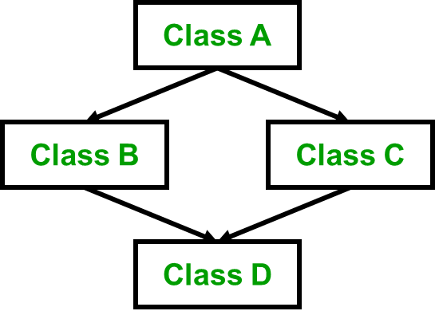

<!---
marp: true
author: Yi-Wen Hung
theme: default
headingDivider: 2
paginate: true
--->

# OOP: Inheritance (2)

> Slides version: [lecture10_slides.html](./lecture10_slides.html)
> Website version: [lecture10.html](./lecture10.html)

- Recap Inheritance
  - Example: Bus, Car, and Truck
  - Inheritance Mode
    - Friend function & Inheritance (public, protected, private)
* Inheritance Type
  - Single, Multiple, Multi-level (discuss in the previous lecture)
  - Hierarchical
  - Hybrid
  - Multipath inheritance
---
* Inheritance in Software Engineering
  - Reusable & Efficient
  - Is a (Inheritance) & Has a (Composition)
* Example 1: Integer & Real & Complex Number Calculator
* Example 2: Complex Number & Triangle
* Example 3: Complex Number & Triangles

## Recap Inheritance

Ref: [Inheritance in C++](https://www.geeksforgeeks.org/inheritance-in-c/)

### Example: Bus, Car, and Truck.


---

Because bus, car and truck are all vehicles, and they all have the same member functions, we can use inheritance to reduce the amount of code we need to write. For example, `class Vehicle`:


---
### Example: Bus, Car, and Truck.

``` c++
#include <iostream>

using namespace std;

class Vehicle
{
public:
    void run()
    {
        std::cout << "Vehicle is running" << std::endl;
    }
};
class Bus : public Vehicle
{
};
class Car : public Vehicle
{
};
```
---
``` c++
class Truck : public Vehicle
{
};
int main()
{
    Bus bus;
    Car car;
    Truck truck;
    bus.run();
    car.run();
    truck.run();
    return 0;
}
```
Output:

```console
$ ./a.out
Vehicle is running
Vehicle is running
Vehicle is running
```

---
### Inheritance Mode

| Class Member Type |      Type of       |    Inheritence     |                    |
| :---------------: | :----------------: | :----------------: | :----------------: |
|                   |       Public       |     Protected      |      Private       |
|      Public       |     **Public**     |   **Protected**    |    **Private**     |
|     Protected     |   **Protected**    |   **Protected**    |    **Private**     |
|      Private      | **Not accessible** | **Not accessible** | **Not accessible** |

---
### Friend function & Inheritance

``` c++
class A
{
public:
    int x;
    friend void f_x(A &a)
    {
        a.x = 1;
    }

protected:
    int y;
    friend void f_y(A &a)
    {
        a.y = 2;
    }

private:
    int z;
    friend void f_z(A &a)
    {
        a.z = 3;
    }
};
```
---
``` c++
class B : public A
{
    // x is public
    // y is protected
    // z is not accessible from B
};

class C : protected A
{
    // x is protected
    // y is protected
    // z is not accessible from C
};

class D : private A // 'private' is default for classes
{
    // x is private
    // y is private
    // z is not accessible from D
};
```
---
``` c++
int main()
{
    A a;
    B b;
    C c;
    D d;

    f_x(a);
    f_y(a);
    f_z(a);

    f_x(b);
    f_y(b);
    f_z(b);

    f_x(c); // error: not accessible
    f_y(c); // error: not accessible
    f_z(c); // error: not accessible

    f_x(d); // error: not accessible
    f_y(d); // error: not accessible
    f_z(d); // error: not accessible

    return 0;
}
```

## Inheritance Type
  - Single (discuss in the previous lecture)
  - Multiple (discuss in the previous lecture)
  - Multi-level (discuss in the previous lecture)
  - Hierarchical 
  - Hybrid (Virtual) Inheritance 
  - Multipath inheritance 

---
### Hierarchical Inheritance


``` c++
// C++ program to implement
// Hierarchical Inheritance
#include <iostream>
using namespace std;

// base class
class Vehicle
{
public:
    Vehicle()
    {
        cout << "This is a Vehicle\n";
    }
};

// first sub class
class Car : public Vehicle
{
};

// second sub class
class Bus : public Vehicle
{
};

// main function
int main()
{
    // Creating object of sub class will
    // invoke the constructor of base class.
    Car obj1;
    Bus obj2;
    return 0;
}
```

---
### Hybrid (Virtual) Inheritance


``` c++
// C++ program to explain
// multiple inheritance
#include <iostream>
using namespace std;

// first base class
class Vehicle
{
public:
    Vehicle()
    {
        cout << "This is a Vehicle\n";
    }
};

// second base class
class FourWheeler
{
public:
    FourWheeler()
    {
        cout << "This is a 4 wheeler Vehicle\n";
    }
};

// sub class derived from two base classes
class Car : public Vehicle, public FourWheeler
{
};

// main function
int main()
{
    // Creating object of sub class will
    // invoke the constructor of base classes.
    Car obj;
    return 0;
}
```

---
### Multipath inheritance



``` c++
#include <iostream>

class ClassA
{
public:
    int a;
};

class ClassB : virtual public ClassA
{
public:
    int b;
};

class ClassC : virtual public ClassA
{
public:
    int c;
};

class ClassD : public ClassB, public ClassC
{
public:
    int d;
};

int main()
{
    ClassD obj;

    obj.a = 10;  // Statement 3
    obj.a = 100; // Statement 4

    obj.b = 20;
    obj.c = 30;
    obj.d = 40;

    cout << "\n a : " << obj.a;
    cout << "\n b : " << obj.b;
    cout << "\n c : " << obj.c;
    cout << "\n d : " << obj.d << '\n';
}
```

## Inheritance in Software Engineering

Why use inheritance?

> Inheritance is used all the time when writing object-oriented code.
> In most OO languages, (with C++ being a prominent exception,) all objects have a single "base object" class that they derive from that provides common functionality, so literally everything that uses an object uses inheritance.

Ref: [Mason Wheeler](https://softwareengineering.stackexchange.com/a/190788)

---

Why use inheritance?
- Reuse code
  * You can reuse code by inheriting from a class without having to copy/paste the code.
  * Also, you can reuse pre-built codes with inheritance.
- Code integrity
  * You can ensure that your code is consistent, i.e. the structure of the code is the same for all derived classes.

---
### Pros of Inheritance

Advantages:
- Inheritance promotes reusability. When a class inherits or derives another class, it can access all the functionality of inherited class.
* Reusability enhanced reliability. The base class code will be already tested and debugged.
* As the existing code is reused, it leads to less development and maintenance costs.
* Inheritance makes the sub classes follow a standard interface.
* Inheritance helps to reduce code redundancy and supports code extensibility.
* Inheritance facilitates creation of class libraries.

Ref: [vaishali bhatia](https://practice.geeksforgeeks.org/problems/what-are-advantages-and-disadvantages-of-using-inheritance)

---
### Cons of Inheritance

Disadvantages:
- Inherited functions work slower than normal function as there is indirection.
* Improper use of inheritance may lead to wrong solutions.
* Often, data members in the base class are left unused which may lead to memory wastage.
* Inheritance increases the coupling between base class and derived class. A change in base class will affect all the child classes.

Ref: [vaishali bhatia](https://practice.geeksforgeeks.org/problems/what-are-advantages-and-disadvantages-of-using-inheritance)

---
### Is a (Inheritance) & Has a (Composition)

When to use inheritance?
* If object B is an object A, then inheritance is used.
* e.g. an apple is a fruit, so inheritance is used.

When to use composition?
* If object B has object A, then composition is used.
* e.g. a car has a engine, so composition is used.

---
### Pitfall: Use Inheritance in Has-a Relationship

``` c++
class Legs
{
public:
    void WalkAround() {... code for walking around goes here... }
};

class Arms
{
public:
    void GrabThings() {... code for grabbing things goes here... }
};

class InheritanceRobot : public Legs, public Arms
{
public:
    // WalkAround() and GrabThings() methods are implicitly
    // defined for this class since it inherited those
    // methods from its two superclasses
};

class CompositionRobot
{
public:
    void WalkAround() { legs.WalkAround(); }
    void GrabThings() { arms.GrabThings(); }

private:
    Legs legs;
    Arms arms;
};
```

Ref: [Jeremy Friesner](https://stackoverflow.com/a/49890573/7319728)

## Example 1: Integer & Real & Complex Number Calculator [[Source](./lecture10_ex1.html)]

## Example 2: Complex Number & Triangle [[Source](./lecture10_ex2.html)]

## Example 3: Complex Number & Triangles [[Source](./lecture10_ex3.html)]
