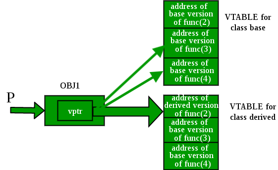

<!---
marp: true
author: Yi-Wen Hung
theme: default
headingDivider: 2
paginate: true
--->

# OOP: Polymorphism (2)

> Slides version: [lecture12_slides.html](./lecture12_slides.html)
> Website version: [lecture12.html](./lecture12.html)

- Recap Polymorphism
  - Example: Bus, Car, and Truck.
  - Polymorphism Types
    - Compile time, Run time
  - Pointer to Polymorphic Objects
    - What is a pointer? and how to use it?
    - How a pointer to a polymorphic object works? (Late binding)
---
* Polymorphism in Software Engineering
  - Pros & Cons
  - Compile time & Run time
* Example 1: Integer & Real & Complex Number Calculator
* Example 2: Complex Number & Triangles
* Lab 6: Complex Number Calculator

## Recap Polymorphism

### Example: Bus, Car, and Truck

- A Bus:
  - has 4 wheels
  - has 20 seats
  - has 2 doors
  - has 20 windows
- A Car:
  - has 4 wheels
  - has 4 seats
  - has 4 doors
  - has 4 windows
---
- A Truck:
  - has 6 wheels
  - has 2 seats
  - has 2 doors
  - has 2 windows

---
### Polymorphism Types

- In C++ polymorphism is mainly divided into two types:
  - Compile time Polymorphism
  - Runtime Polymorphism


---
### Compile time Polymorphism (Function/Operator Overloading)

``` c++
// C++ program for function overloading
#include <iostream>

using namespace std;
class Geeks
{
public:
    // function with 1 int parameter
    void func(int x)
    {
        cout << "value of x is " << x << endl;
    }

    // function with same name but 1 double parameter
    void func(double x)
    {
        cout << "value of x is " << x << endl;
    }

    // function with same name and 2 int parameters
    void func(int x, int y)
    {
        cout << "value of x and y is " << x << ", " << y << endl;
    }
};
```
---
``` c++
int main()
{

    Geeks obj1;

    // Which function is called will depend on the parameters passed
    // The first 'func' is called
    obj1.func(7);

    // The second 'func' is called
    obj1.func(9.132);

    // The third 'func' is called
    obj1.func(85, 64);
    return 0;
}
```

---
### Runtime Polymorphism (Virtual Function with object pointer)

``` c++
// C++ program for function overriding

#include <iostream>
using namespace std;

class base
{
public:
    virtual void print()
    {
        cout << "print base class" << endl;
    }

    void show()
    {
        cout << "show base class" << endl;
    }
};
```
---
``` c++
class derived : public base
{
public:
    void print() // print () is already virtual function in derived class,
                 // we could also declared as virtual void print () explicitly
    {
        cout << "print derived class" << endl;
    }

    void show()
    {
        cout << "show derived class" << endl;
    }
};
```
---
``` c++
// main function
int main()
{
    base *bptr;
    derived d;
    bptr = &d;

    // virtual function, binded at runtime (Runtime polymorphism)
    bptr->print();

    // Non-virtual function, binded at compile time
    bptr->show();

    return 0;
}
```

---
### Pointer to Polymorphic Objects

Ref: [Virtual Function in C++](https://www.geeksforgeeks.org/virtual-function-cpp)

Consider the example:

``` c++
// CPP program to illustrate
// working of Virtual Functions
#include <iostream>
using namespace std;

class base
{
public:
    void fun_1() { cout << "base-1\n"; }
    virtual void fun_2() { cout << "base-2\n"; }
    virtual void fun_3() { cout << "base-3\n"; }
    virtual void fun_4() { cout << "base-4\n"; }
};

class derived : public base
{
public:
    void fun_1() { cout << "derived-1\n"; }
    void fun_2() { cout << "derived-2\n"; }
    void fun_4(int x) { cout << "derived-4\n"; }
};
```


---
#### What is a pointer? and how to use it?

Ref: [Pointer in C++](https://www.geeksforgeeks.org/pointers-in-c-and-c-set-1-introduction-arithmetic-and-array)

> Pointers store address of variables or a memory location. 


---
#### Example: Pointer

``` c++
// C++ program to demonstrate use of * for pointers in C++
#include <iostream>
using namespace std;
int main()
{
    // A normal integer variable
    int Var = 10;
    // A pointer variable that holds address of var.
    int *ptr = &Var;
    // This line prints value at address stored in ptr.
    // Value stored is value of variable "var"
    cout << "Value of Var = " << *ptr << endl;
    // The output of this line may be different in different
    // runs even on same machine.
    cout << "Address of Var = " << ptr << endl;
    // We can also use ptr as lvalue (Left hand
    // side of assignment)
    *ptr = 20; // Value at address is now 20
    // This prints 20
    cout << "After doing *ptr = 20, *ptr is " << *ptr << endl;
    return 0;
}
// This code is contributed by
// shubhamsingh10
```

---
Output:

``` console
Value of Var = 10
Address of Var = 0x7fffa057dd4
After doing *ptr = 20, *ptr is 20
``` 


---
#### How a pointer to a polymorphic object works? (Late binding)

Ref: [Virtual Functions and Runtime Polymorphism in C++](https://www.geeksforgeeks.org/virtual-functions-and-runtime-polymorphism-in-c-set-1-introduction)


The compiler maintains two things to serve this purpose:

1. *vtable*: A table of function pointers, maintained per class. 
2. *vptr*: A pointer to vtable, maintained per object instance.

---

Consider the example:

``` c++
// CPP program to illustrate
// working of Virtual Functions
#include <iostream>
using namespace std;

class base
{
public:
    void fun_1() { cout << "base-1\n"; }
    virtual void fun_2() { cout << "base-2\n"; }
    virtual void fun_3() { cout << "base-3\n"; }
    virtual void fun_4() { cout << "base-4\n"; }
};

class derived : public base
{
public:
    void fun_1() { cout << "derived-1\n"; }
    void fun_2() { cout << "derived-2\n"; }
    void fun_4(int x) { cout << "derived-4\n"; }
};
```


---

On the runtime:

``` c++
int main()
{
    base *p;
    derived obj1;
    p = &obj1;

    // Early binding because fun1() is non-virtual
    // in base
    p->fun_1();

    // Late binding (RTP)
    p->fun_2();

    // Late binding (RTP)
    p->fun_3();

    // Late binding (RTP)
    p->fun_4();

    // Early binding but this function call is
    // illegal (produces error) because pointer
    // is of base type and function is of
    // derived class
    // p->fun_4(5);

    return 0;
}
```



## Polymorphism in Software Engineering

Ref: https://en.wikipedia.org/wiki/Polymorphism_(computer_science)

> Polymorphism is the provision of a single interface to entities of different types[1](http://www.stroustrup.com/glossary.html#Gpolymorphism) or the use of a single symbol to represent multiple different types.[2](https://doi.org/10.1145%2F6041.6042) 
> The concept is borrowed from a principle in biology where an organism or species can have many different forms or stages.[3](https://docs.oracle.com/javase/tutorial/java/IandI/polymorphism.html)

---
### Pros & Cons of Polymorphism

#### Pros

- Reuse codes with various types of objects.
- Use the same code/interface to work with different types of objects.
- Use functions when the application is running.

---
#### Cons

> One of the disadvantages of polymorphism is that developers find it difficult to implement polymorphism in codes.
> Run time polymorphism can lead to the performance issue as machine needs to decide which method or variable to invoke so it basically degrades the performances as decisions are taken at run time.
> Polymorphism reduces the readability of the program. One needs to identify the runtime behavior of the program to identify actual execution time.

Ref: [Akanksha Patel](https://www.quora.com/What-are-the-disadvantages-of-polymorphism)

---
### Compile time & Run time Polymorphism

Difference between compile time and run time polymorphism:

> Static polymorphism produces faster code, mostly because of the possibility of aggressive inlining. Virtual functions can rarely be inlined, and mostly in a "non-polymorphic" scenarios. ...
> On the other hand, not only compile times, but also the readability and debuggability of the code is much worse when using static polymorphism. 
> For instance: abstract methods are a clean way of enforcing implementation of certain interface methods. ...

Ref: [maciek gajewski](https://stackoverflow.com/a/16876567)

## Example 1: Integer & Real & Complex Number Calculator [[Source](./lecture12_ex1.html)]

## Example 2: Complex Number & Triangles [[Source](./lecture12_ex2.html)]

## Lab 12: [Complex Number's Geometry & Operations](./lab/lab12-1.html)